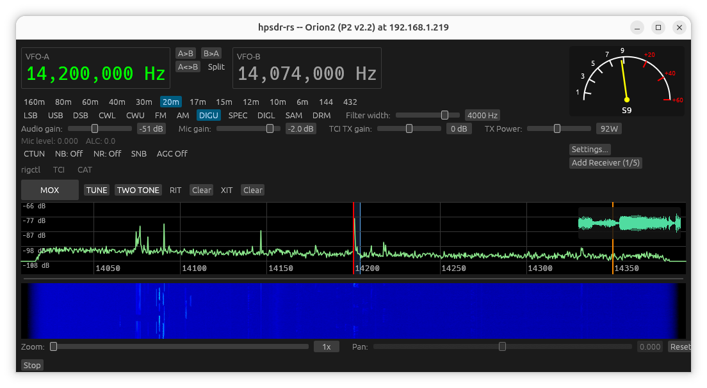

# hpsdr-rs


A Rust/egui desktop client for [openHPSDR](https://openhpsdr.org/) Protocol 1 and Protocol 2 radios (Metis/Ozy-style and Hermes/Orion-style boards), using [WDSP](https://github.com/NR0V/wdsp) for DSP.

> **Status: early / actively in development.** RX has seen the most real-world testing. TX works and has been used for real QSOs, but parts of the TX signal path are still noted in the source as unverified against the official protocol spec on untested hardware. **Always bench-test into a dummy load at reduced drive before transmitting into a real antenna**, especially after pulling a new build.



## Origins

This project started as an experiment: could Claude port the discovery code from rustyHPSDR -- originally written in GTK4 -- over to Rust's egui framework, which is more portable? That worked remarkably well. The plan at that point was to have Claude port the rest of rustyHPSDR to egui too, but that turned into a different question instead: having pointed Claude at the rustyHPSDR and piHPSDR source as reference, how much of a complete application could it actually develop from there? This project is the result so far. The only code I wrote by hand is the original discovery implementation that was ported to egui -- everything else came out of interacting with Claude and running real-hardware debugging sessions to chase down bugs.

-- John Melton, G0ORX/N6LYT

## Features

- Protocol 1 (Metis/Ozy) and Protocol 2 (Hermes/Orion) support, with standard openHPSDR UDP discovery (broadcast, port 1024)
- Multiple simultaneous receivers (main receiver + independent "extra receiver" windows), each with its own VFO, mode, filter width, and band memory
- Spectrum/waterfall display with adjustable dB range, palette, and Click-to-Tune (CTUN)
- SSB/CW/AM/FM/digital modes, per-mode/per-band filter width and mode memory
- Noise blanker (NB/NB2), noise reduction (NR/NR2/NR3/NR4), and SNB (spectral noise blanker), independently switchable
- AGC with selectable Off/Long/Slow/Medium/Fast modes
- TX: mic audio through WDSP's TXA chain, ALC, TX power/SWR meter with per-band PA calibration, and a Tune button (WDSP PostGen tone centered in the passband, at a separate reduced "Tune Power" for safe antenna/PA tuning)
- PureSignal (PA linearization/predistortion), on both Protocol 1 and Protocol 2 — see [PureSignal calibration](#puresignal-calibration) below for how to set it up
- rigctl (Hamlib-compatible), TCI (WebSocket), and CAT (Kenwood TS-2000 emulation) control servers, for use with WSJT-X, N1MM+, Log4OM, and similar logging/digital-mode software
- Dual VFO (VFO A/B) with Split -- transmit on VFO B while receiving on VFO A
- Selectable RX output / TX input audio devices (independent of the OS default), for routing through virtual audio cables
- Per-radio settings persistence (keyed by the radio's MAC address, so multiple physical radios each keep their own saved configuration)
- FPGA firmware upload and static IP configuration — see [Firmware update](#firmware-update) below

## Supported hardware

Any board the standard openHPSDR discovery protocol reports as one of: Metis, Hermes, Hermes2, Angelia, Orion, Orion2, HermesLite, or HermesLite2 (this covers most Protocol 1/2 hardware, including the ANAN series). The discovery/board-type reply doesn't distinguish specific models or their actual max power (e.g. a 100W vs. 200W ANAN both report as Orion2) — set your radio's actual max TX power in Settings once connected.

## Building

Developed and tested primarily on Linux. A Windows build (via MSVC + vcpkg)
has also been confirmed to build and run successfully — see below. Two
Windows toolchains are supported. macOS support is new and NOT yet
confirmed on real hardware (no Mac was available to test with) — see its
own section below, and the macOS entry in this repo's CI (Actions tab)
for the current build status.

**Linux:**
- A recent Rust toolchain (`rustup` recommended)
- FFTW3 development headers (`apt install libfftw3-dev` or your distro's equivalent)
- ALSA development headers for audio I/O (e.g. `apt install libasound2-dev`)

**macOS:**
- A recent Rust toolchain (`rustup` recommended)
- Xcode Command Line Tools, for a C compiler (`xcode-select --install`)
- [Homebrew](https://brew.sh/), then `brew install fftw pkg-config`
- No ALSA-equivalent package needed — `cpal` (audio I/O) talks to
  CoreAudio directly, built in to macOS
- Native (Apple Silicon or Intel) target, no cross-compilation flags
  needed — just `cargo build --release` like Linux
- The vendored WDSP/libspecbleach/rnnoise C source (`build.rs`) already
  branches on `#if defined(linux) || defined(__APPLE__)` internally (this
  project ported that branching as-is, unmodified, from the upstream
  source), so no source changes were needed to get this far — genuinely
  untested beyond that read-through and a clean `cargo build` in CI,
  though, so if something doesn't compile or misbehaves on your Mac,
  please open an issue

**Windows via MSYS2/MinGW-w64:**
- [MSYS2](https://www.msys2.org/), then from an **MSYS2 MinGW64** shell: `pacman -S mingw-w64-x86_64-toolchain mingw-w64-x86_64-fftw mingw-w64-x86_64-pkg-config`
- Rust's `x86_64-pc-windows-gnu` target (`rustup target add x86_64-pc-windows-gnu`)
- Build with `gcc`/`pkg-config` reachable on `PATH` (either build from that same MSYS2 MinGW64 shell, or add `<msys2 install dir>\mingw64\bin` to your own shell's `PATH`) and `--target x86_64-pc-windows-gnu`

**Windows via MSVC:**
- Visual Studio Build Tools (C++ workload) — needed for any `x86_64-pc-windows-msvc`-target Rust build regardless of this project
- [vcpkg](https://vcpkg.io/), with `vcpkg install fftw3:x64-windows-static` (the `vcpkg` crate defaults to looking for the static triplet; static linking also means no `fftw3.dll` to ship alongside the built `.exe`), and either `VCPKG_ROOT` set to your vcpkg checkout or `vcpkg integrate install` run once
- No `PATH`/pkg-config setup needed — `build.rs` talks to vcpkg and locates MSVC directly
- Confirmed building AND running successfully this way (2026-08-19)
- The [Firmware update](#firmware-update) feature additionally needs the [Npcap SDK](https://npcap.com/#download) at build time (its `Packet.lib`) — download and extract it, then set `NPCAP_SDK_DIR` to that folder; `build.rs` adds its `Lib/x64` to the linker's search path automatically (same idea as `VCPKG_ROOT` above, not a native cargo/MSVC mechanism). A real "`Packet.lib` not found" link error on a fresh Windows build confirmed this step is actually needed — if it still can't be found with `NPCAP_SDK_DIR` set, double check the SDK zip's actual internal folder layout against `<NPCAP_SDK_DIR>\Lib\x64\Packet.lib`

WDSP and its noise-reduction dependencies (libspecbleach, rnnoise) are vendored as C source under `vendor/` and built automatically from source by `build.rs` (via the `cc` crate) — no separate build step, and no prebuilt platform-specific binaries to obtain or keep in sync.

```sh
cargo build --release
```

## Running

```sh
cargo run --release
```

The app opens a discovery window that listens for radios on the network; select one to connect. Settings (frequency, mode, filter width, TX power, calibration, etc.) are saved automatically per-radio under `~/.config/hpsdr-rs/` (Linux), `%APPDATA%\hpsdr-rs\` (Windows), or `~/Library/Application Support/hpsdr-rs/` (macOS).

See the **[User Manual](docs/manual/README.md)** for a full walkthrough of the UI -- every settings tab, tuning gestures, extra receivers, and the PureSignal/Diversity/Equalizer features.

## Firmware update

Two independent, unrelated ways to update a radio's FPGA firmware (`.rbf` file) or change its static IP, matching how the openHPSDR reference tools (Apache Labs' `HPSDRBootloader`/`HPSDRProgrammer`) split this into two separate utilities:

- **Bootloader mode** (Discovery screen → **Firmware Update...**) — for Metis, Hermes, Hermes2, Angelia, Orion, and Orion2. The radio must already be physically switched into bootloader mode (a jumper or slide switch, board-dependent) and power-cycled — nothing over the network can do this for you. Uses raw Ethernet frames, **not** IP/UDP, so it only works over a direct cable or a plain unmanaged switch (not through a router, VPN, or most managed switches), and needs elevated privileges on every platform:
  - **Linux**: run as root, or grant the built binary the capability once: `sudo setcap cap_net_raw+ep target/release/hpsdr-rs`
  - **Windows**: install [Npcap](https://npcap.com/) (in "WinPcap API-compatible mode") and run hpsdr-rs as Administrator
  - **macOS**: run as root, or grant access to `/dev/bpf*`
  
  If an upload is interrupted (dropped packet, timeout, cancelled) the radio's bootloader firmware itself has no way to recover — **power-cycle the radio before trying again**. This can't brick the radio permanently: Erase/Program can only reach the separate "Application" flash region, never the bootloader/recovery image itself.

- **In-application update** (while connected → Settings → Network → **Firmware Update...**) — works against a normally-running, already-connected radio, no physical switch needed. Less thoroughly verified than bootloader mode — prefer bootloader mode when available. Automatically stops this radio's active session first (required for the radio to actually respond) and reconnects once the update completes.

See the manual's **[Firmware Update](docs/manual/13-firmware-update.md)** page for the full step-by-step procedure and warnings.

## Packaging (Debian/Ubuntu)

A `.deb` can be built with [`cargo-deb`](https://crates.io/crates/cargo-deb):

```sh
cargo install cargo-deb   # one-time
cargo deb
```

This produces `target/debian/hpsdr-rs_<version>_amd64.deb`, installing the binary to `/usr/bin/hpsdr-rs`, a desktop menu entry and app icon, and the README/manual under `/usr/share/doc/hpsdr-rs/`. Runtime dependencies (FFTW3, ALSA, etc.) are detected automatically from the built binary. Install with:

```sh
sudo apt install ./target/debian/hpsdr-rs_<version>_amd64.deb
```

## PureSignal calibration

PureSignal is enabled in Settings (takes effect on the next connect), then configured live in Settings → PureSignal while transmitting. The one setting that actually matters — and the thing to change first if calibration won't complete or `Correcting` never turns on — is **HW Peak**, which has to track the *real* envelope peak your radio produces at whatever drive level you're actually calibrating at. It is not a fixed per-board constant to leave alone, and the **Feedback Level** meter's "ideal" 90-256 range is only a rough guide, not a hard requirement — calibration has been confirmed working on real hardware at feedback levels both far below (single digits) and far above (thousands) that range, as long as HW Peak itself is right.

Procedure, on any radio:
1. Set **Tune Power %** low (start around 10-15%) — PureSignal calibration works best at a low real TX drive level, not a normal operating power.
2. Press **Two Tone** (not Tune — a steady tone's constant envelope can never fill PureSignal's calibration buckets) and watch **Measured Peak TX** in the PureSignal panel for a few seconds.
3. Set **HW Peak** to just above whatever Measured Peak TX settled at.
4. Re-engage Two Tone. `Correcting` should turn on within a few seconds. If it doesn't:
   - Stuck with Feedback Level at 0 and no progress: HW Peak is likely still too far from the true peak — recheck Measured Peak TX and adjust again.
   - `Correcting` flickers on/off or never turns on despite Feedback Level being nonzero: try nudging Tune Power % up or down a little and repeat from step 2 — the exact drive level a clean calibration converges at is somewhat radio-dependent.

## Roadmap

Current focus is on stabilizing and testing Protocol 1 and Protocol 2 operation, including PureSignal, across more radios.

## Contributing

Issues and pull requests are welcome. A few things that'll help:

- **For anything touching the TX path**: bench-test into a dummy load at reduced drive before a real antenna, and say in the PR description what you actually tested it against (mode, protocol, hardware). Several TX bugs in this project's history turned out to be protocol- or radio-specific, so mentioning which you used helps a lot.
- **Reference-driven DSP/protocol changes**: where this project's behavior is meant to match a known-working implementation (piHPSDR, rustyHPSDR, Thetis, or the official openHPSDR protocol docs/WDSP source), please check against the actual reference rather than a plausible-sounding guess, and say which reference and where in the PR/commit message. A few real bugs here came from parameter changes that sounded reasonable but turned out not to match how any working reference actually behaves.
- **Comments**: explain *why*, not *what* -- code should already say what it does. A comment earns its place by capturing a non-obvious constraint, a reference confirmation, or the reasoning behind a fix, not by restating the line below it.
- For larger changes, opening an issue first to discuss the approach is appreciated before investing in a big PR.

## License

GNU General Public License, version 2 or (at your option) any later version -- see [LICENSE](LICENSE). This matches WDSP's own license, which hpsdr-rs statically links against.
