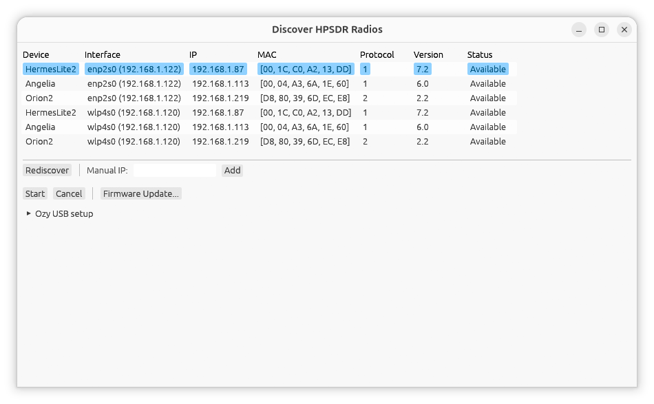

[Index](README.md) | [Main Window →](02-main-window.md)

# Getting Started

## Installing and running

See the [top-level README](../../README.md#building) for build requirements
and instructions. Once built:

```sh
cargo run --release
```

## Discovering your radio

On launch, the **Discover HPSDR Radios** window opens automatically and
immediately starts discovering radios on all the network interfaces (standard
openHPSDR UDP discovery broadcast, port 1024).



The window lists every radio that responded, one row per device, with
columns:

| Column | Meaning |
|---|---|
| Device | Board type (e.g. `Orion2`, `Hermes`, `HermesLite2`) |
| Interface | The local network interface the reply was heard on -- name and IP address (e.g. `eth0 (192.168.1.50)`), or just the IP if the interface's name isn't known (a manually-entered IP, see below) |
| IP | The radio's own IP address |
| MAC | The radio's MAC address (also used as the key for its saved settings) |
| Protocol | 1 (Metis/Ozy-style) or 2 (Hermes/Orion-style) |
| Version | Firmware version |
| Status | **Available** or **In Use** |

Click anywhere on a row to select it -- the whole row highlights. Only
**Available** radios can be selected and started; a radio already **In Use**
(by another client, or another instance of this app) is shown but disabled.
Double-clicking an **Available** row starts it immediately, same as
selecting it and pressing **Start**.

The first **Available** radio in the list is selected automatically as
soon as results land (skipping over any radio already **In Use**), so you
can usually just click **Start** -- or double-click that row.

**Rediscover** clears the current list and scans again -- useful if your
radio was slow to respond or you just powered it on.

**Manual IP** lets you connect directly to a known IP address instead of
waiting for a broadcast reply to arrive, which is useful if your radio is on
a different subnet than broadcast discovery can reach (e.g. across a router
that doesn't forward broadcasts). Type the address into the field and click
**Add**; if a radio responds there, it's added to the list the same as a
broadcast-discovered one.

**Firmware Update...** opens a separate window for updating a radio's FPGA
firmware or changing its IP address while it's in bootloader mode -- see
[Firmware Update](09-firmware-update.md).

**Ozy USB setup** is for the original HPSDR hardware (an Ozy board with
separate Mercury/Penny boards), which connects over USB instead of the
network and needs a one-time driver/firmware setup before it shows up in
this list -- see [Ozy USB](19-ozy-usb.md) for the full walkthrough.

## Connecting

With a radio selected, click **Start**. The app connects, opens the main
window, and restores that radio's last-used settings (frequency, mode,
filter width, calibration, etc.) automatically -- each physical radio (by
MAC address) keeps its own independent saved configuration, so switching
between radios doesn't mix up their settings.

To disconnect, use the **Stop** button at the bottom of the main window.
This returns you to the discovery window.

---

[Index](README.md) | [Main Window →](02-main-window.md)
