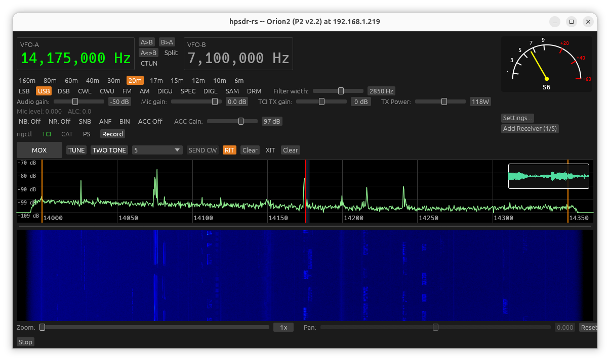
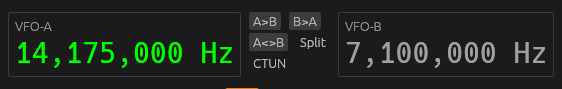
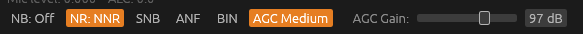
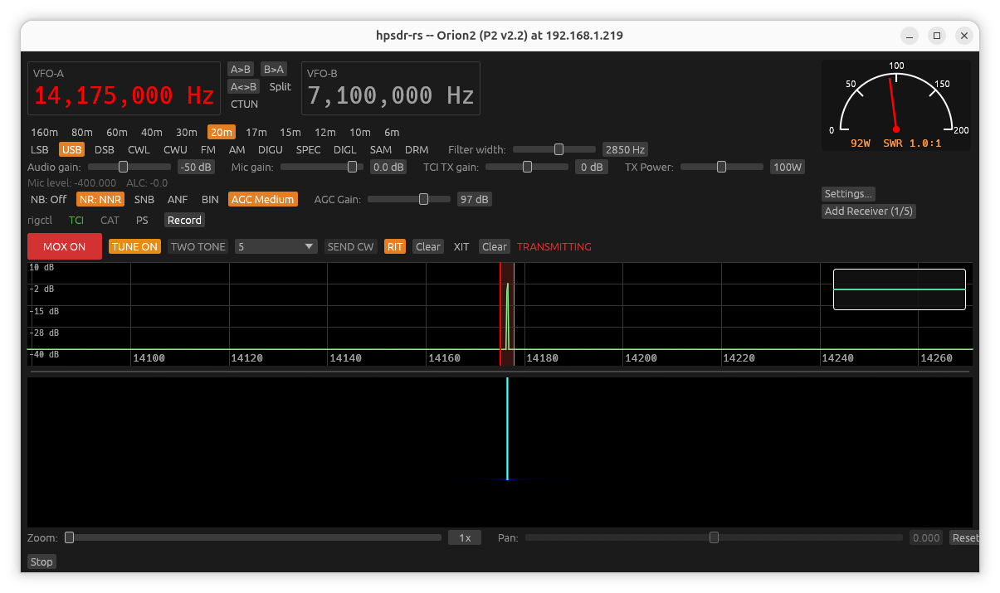
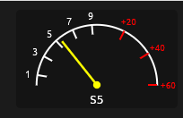
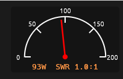

[← Getting Started](01-getting-started.md) | [Index](README.md) | [Network →](03-settings-network.md)

# Main Window

## Frequency display and tuning

The large number near the top, in its own **VFO-A** box, is the current
main VFO frequency (comma-grouped, in Hz) -- green normally, red while
that VFO is the one actually transmitting (see
[Split](#vfo-a--vfo-b--split) below). You can tune it several ways:

- **Scroll** while hovering the frequency display, or the spectrum/waterfall
  panes: steps by 1 kHz per notch. Hold **Shift** while scrolling for 100 Hz
  steps.
- **Ctrl + scroll** (or a pinch/zoom gesture) over the spectrum: steps by
  10 kHz per notch.
- **Click** directly on the spectrum or waterfall: retunes straight to the
  clicked frequency (rounded to the nearest kHz).
- **Click and drag** across the spectrum or waterfall: retunes by however
  far you've dragged, in whichever direction -- like grabbing and moving
  the display itself (drag right to bring lower frequencies into view,
  left for higher), rather than jumping straight to wherever the cursor
  ends up.

### CTUN (Click to Tune)

The **CTUN** button toggles an alternate tuning mode: instead of retuning
the radio's actual hardware oscillator on every click/scroll, the *listen
point* moves within the currently-received passband, and the radio's real
tuned frequency stays fixed. This is useful for quickly browsing around a
band without the radio re-locking/re-settling each time. The CTUN dial is
clamped so the current mode's filter passband always stays fully within the
visible spectrum span.

While CTUN is on, VFO B's **B>A** and **A<>B** buttons (below) move the
CTUN listen point the same clamped way, rather than retuning the radio's
actual hardware oscillator.

## VFO A / VFO B / Split

Next to the **VFO-A** box is a second, independent **VFO-B** box -- a
second remembered frequency with no receiver of its own (this app doesn't
receive on two frequencies at once). You can scroll on the VFO-B box the
same way as VFO-A (Shift for 100 Hz steps, otherwise 1 kHz) to change its
stored value directly, or use the buttons between the two boxes:

- **A>B** -- copies VFO A's current frequency into VFO B.
- **B>A** -- retunes VFO A to VFO B's frequency (moving the CTUN listen
  point instead of the real hardware frequency if CTUN is on -- see
  above).
- **A<>B** -- swaps VFO A and VFO B.
- **Split** -- while enabled, transmit uses VFO B's frequency instead of
  VFO A's, while reception continues on VFO A as normal. The box that's
  actually red while transmitting follows whichever VFO is really in use
  -- VFO A normally, VFO B when Split is on -- so the highlight always
  points at what's really going out over the air.

## Bands and modes

One row of band buttons -- **160m, 80m, 60m, 40m, 30m, 20m, 17m, 15m, 12m,
10m, 6m** -- jumps to that band's remembered frequency, mode, and filter
width (or sensible defaults the first time you visit a band). Each band
remembers its own settings independently as you use the app.

Below that, a row of mode buttons: **LSB, USB, DSB, CWL, CWU, FM, AM, DIGU,
SPEC, DIGL, SAM, DRM**.

Next to the mode row, **Filter width** sets the demodulator passband width
in Hz (50-5000 Hz). Each mode remembers its own last-used width.

## Audio gain

**Audio gain** controls the speaker/headphone volume for the received
audio (this is WDSP's own output gain stage, not your OS/sound-card
volume). The slider is scaled in dB (-100 to +18), so each step is an equal
relative loudness change across the whole range rather than the low end
being too coarse and the high end too fine on a plain linear scale.

## Noise/AGC toggles

A row of cycling buttons, each click advancing to the next state:

- **NB** -- cycles Off → NB → NB2 → Off (two mutually-exclusive noise
  blanker stages; the threshold both share is in Settings → RX).
- **NR** -- cycles Off → NR → NR2 → NR3 → NR4 → Off (four mutually-exclusive
  noise reduction algorithms).
- **SNB** -- toggles the Spectral Noise Blanker on/off, independently of NB
  and NR (it can run alongside either).
- **AGC** -- cycles Off → Long → Slow → Medium → Fast → Off. Attack/decay/
  hang/top/slope/threshold for AGC are tuned in Settings → RX.

## rigctl / TCI / CAT status badges

Small colored badges show whether the rigctl, TCI, and CAT control servers
(configured in Settings → Network) are running:

- Gray -- not running.
- Green -- listening, no client connected (or a PureSignal-specific state
  for the **PS** badge -- see below).
- Red -- a client is currently connected.

Hovering a badge shows its address and current state in a tooltip.

If PureSignal is enabled for the session, a **PS** badge also appears: gray
while enabled but not yet correcting, green while actively correcting, with
the current feedback level shown in the tooltip.

## Transmit controls

This row only appears once TX is armed (Settings → TX → **Enable
Transmit**):

- **MOX** -- toggles transmit on/off. While active it turns red and reads
  **MOX ON**, and a red **TRANSMITTING** label appears.
- **TUNE** -- transmits a steady test tone, centered in the current filter
  passband, at the reduced **Tune Power %** set in Settings → TX (not full
  TX Power) -- for safely tuning an antenna or amplifier.
- **TWO TONE** -- transmits a two-tone test signal instead of a steady
  tone, also at Tune Power. This is required (not just an alternative) for
  PureSignal calibration -- see [PureSignal](09-puresignal.md).
- **Spacebar** is a hold-to-talk shortcut for MOX, active whenever no text
  field has keyboard focus.

While transmitting, a line beneath the gain controls shows **Mic level**
and **ALC** readouts, and Mic gain / TCI TX gain / TX Power sliders appear
alongside Audio gain.

**Always bench-test into a dummy load at reduced drive before transmitting
into a real antenna.** See the [top-level README](../../README.md) for the
project's current TX verification status.

## Spectrum and waterfall

The spectrum pane shows the live signal trace with a shaded band marking
the current filter passband and a vertical line marking the dial frequency
-- blue while receiving, red/orange while transmitting (see
[Settings: Spectrum](06-settings-spectrum.md#while-transmitting) for what
changes about this while Split is in use). Ten frequency-axis gridlines
span the pane; the label at the very first and last one is skipped (the
gridline itself still draws) since it would otherwise get clipped or hang
off the edge. The waterfall pane below it shows the same signal scrolling
over time, colored by the selected palette (Settings → Spectrum).

Drag the thin divider between the two panes to adjust how much vertical
space each gets.

A small waveform display sits in the top-right corner of the spectrum
pane -- a quick visual check that audio is actually flowing, and roughly
what level it's at, without needing an external scope. It shows the
output audio while receiving, and while transmitting switches to whatever
is actually feeding TX right now (local mic, TCI, or the radio's own mic,
whichever is currently selected/active). It traces the RMS loudness
envelope over roughly the last half second (not raw min/max peaks, which
tend to render as a solid block for continuous voice), auto-scaled each
frame to the loudest moment in that window so it stays readable regardless
of the Audio Gain slider or mic input level.

### Zoom and Pan

Below the waterfall, **Zoom** (1x-16x, scroll-adjustable like every other
slider in this app) narrows the visible frequency
window symmetrically around the dial frequency (or, with
[CTUN](#ctun-click-to-tune) on, the CTUN listen frequency instead); **Pan**
then shifts that narrowed window left/right within the full receiver
bandwidth (it has no effect at 1x zoom -- there's nothing to pan to when
the full span is already shown). **Reset** returns to 1x/centered.

This is a real resolution increase, not just a visual stretch of the same
data: zooming in actually grows the underlying FFT size, so the spectrum
trace and waterfall genuinely resolve finer detail the further in you
zoom, the same way piHPSDR and rustyHPSDR's own zoom works. The
frequency-axis ticks and band-edge markers track the current Zoom/Pan
too, and clicking or scrolling to tune still targets the actual frequency
under the cursor/zoomed view, not the underlying full span.

## S-meter / power meter

Anchored in the top-right of the window:

- **Receiving**: a classic analog S-meter, S0-S9 in 6 dB steps, with
  +10..+60 over S9 shown in red.
- **Transmitting**: forward/reverse power and SWR, scaled to your
  configured **Max TX Power** (Settings → TX).

Below the meter:

- **Settings...** opens the [Settings window](03-settings-network.md).
- **Add Receiver (n/max)** adds another independent receiver window (see
  [Extra Receivers](12-extra-receivers.md)) -- hidden once you've reached
  the radio's maximum receiver count, replaced with **All N receivers
  active**.

## Stopping

The **Stop** button at the bottom of the window disconnects from the radio
and returns to the discovery window.

---

[← Getting Started](01-getting-started.md) | [Index](README.md) | [Network →](03-settings-network.md)
