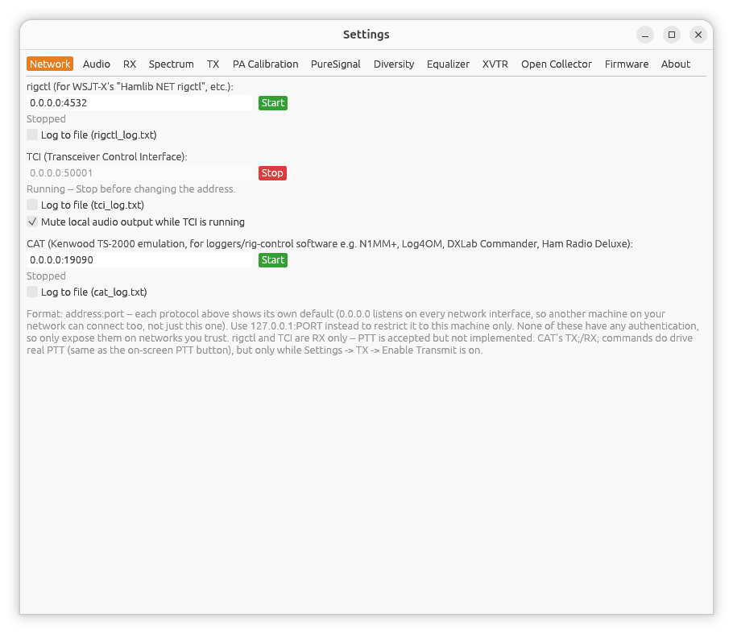

[← Main Window](02-main-window.md) | [Index](README.md) | [RX →](04-settings-rx.md)

# Settings: Network

Open **Settings...** from the main window, then the **Network** tab.

This tab starts and stops two optional control servers that let other
software (loggers, digital-mode programs, remote-control apps) drive
hpsdr-rs. Both are **receive-only** for PTT -- a client can request
transmit, but hpsdr-rs does not currently act on it from these interfaces.
Neither server requires authentication, so only bind `0.0.0.0` (all
interfaces) if you trust your local network.

## rigctl

Hamlib-compatible TCP control, for software that supports "Hamlib NET
rigctl" (e.g. WSJT-X, N1MM, and most logging/digital-mode programs).

- Address field (`host:port`) -- default `0.0.0.0:4532`.
- **Start** / **Stop** button. The address field is disabled while running
  -- stop the server before changing it.
- Status line shows **Running** (with a reminder to stop before changing
  the address) or **Stopped**. A red error line appears if the server
  fails to bind (e.g. the port is already in use).

`0.0.0.0` accepts connections from any machine on your network;
`127.0.0.1` restricts it to this machine only.

## TCI (Transceiver Control Interface)

A WebSocket-based control protocol, used by some digital-mode software
(e.g. as an alternative to rigctl for WSJT-X, or TCI Remote-style clients)
for both control and audio streaming.

- Address field -- default `0.0.0.0:40001`.
- Same **Start**/**Stop**/status behavior as rigctl above.

Neither server auto-starts -- start them explicitly here each session, or
whenever you need them.

---

[← Main Window](02-main-window.md) | [Index](README.md) | [RX →](04-settings-rx.md)
