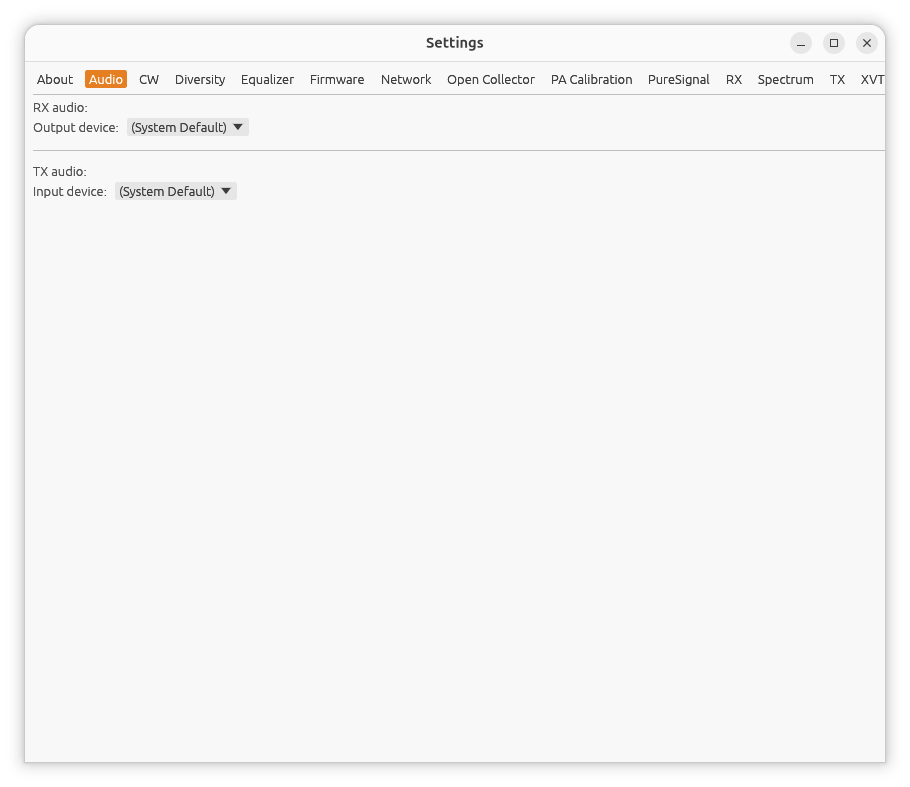

[← Network](03-settings-network.md) | [Index](README.md) | [RX →](05-settings-rx.md)

# Settings: Audio

Open **Settings...** from the main window, then the **Audio** tab.

Picks which real or virtual sound device local RX playback and TX capture
use -- independent of your OS's own default device. This is the same
`cpal`-based device list on every platform (Linux, Windows, macOS).

## RX audio: Output device

Where local RX audio actually plays. **(System Default)** uses whatever
your OS considers the default output device; otherwise pick any listed
device -- for example a virtual cable (VB-Audio Virtual Cable on Windows)
to feed a decoder like WSJT-X, instead of or alongside real speakers.

Changing this restarts local RX playback immediately on the newly selected
device.

## TX audio: Input device

Where TX audio is captured from. **(System Default)** uses your OS's
default microphone; otherwise pick any listed input device -- for example
a virtual cable to feed TX audio in from another application instead of a
real microphone.

Changing this restarts mic capture immediately, without needing to
disable/re-enable transmit (Settings → TX).

## Notes

- If a previously-selected device is no longer present on this machine
  (e.g. a saved virtual-cable choice on a machine that doesn't have it
  installed), hpsdr-rs falls back to the system default rather than
  failing to start audio at all.
- Each [extra receiver](12-extra-receivers.md) has its own, independent
  Output device picker in its own Settings window's **RX** tab -- so, for
  example, the main receiver can go to real speakers while an extra
  receiver feeds a virtual cable for a second decoder, or vice versa.

---

[← Network](03-settings-network.md) | [Index](README.md) | [RX →](05-settings-rx.md)
