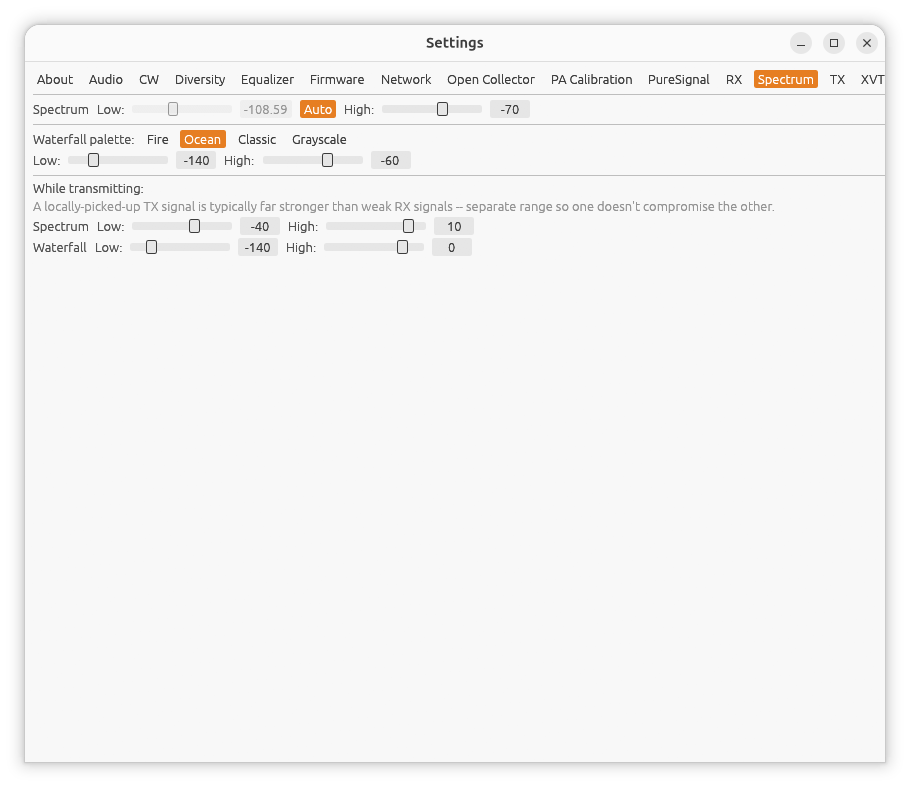
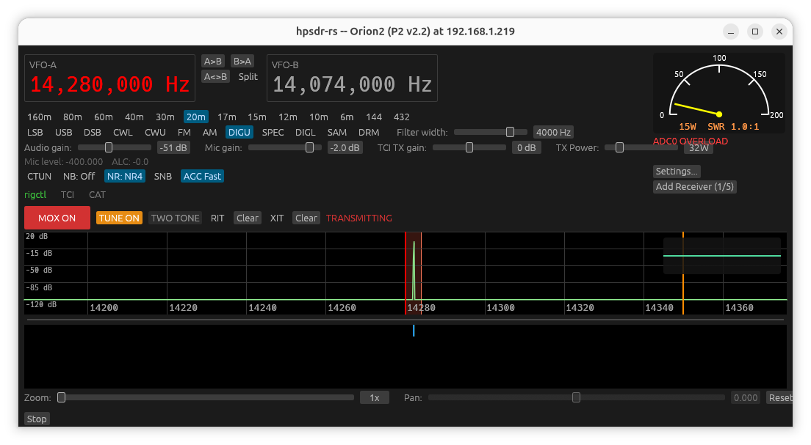

← [Manual index](README.md)

# Settings: Spectrum

Open **Settings...** from the main window, then the **Spectrum** tab.

(Screenshot needed: the Spectrum settings tab)

## Display range

**Low** and **High** sliders (-180.0 to 0.0 dB) set the dB range the
spectrum trace is drawn against -- signals below **Low** sit at the bottom
of the pane, signals at or above **High** clip at the top. A separate pair
of sliders sets the same range for the waterfall.

If a strong or weak station always looks pinned to the top or bottom of the
display, adjust these.

## Waterfall palette

Four color palettes: **Fire, Ocean, Classic, Grayscale**. Pick whichever is
easiest to read for you.

## While transmitting

The spectrum/waterfall panes switch to a separate TX-specific display (fed
from your own transmitted signal, not off-air reception) while MOX is
active, since your TX signal is typically much stronger than anything
you'd receive. A second set of **Low**/**High** sliders (default -180.0 to
40.0 dB -- a wider range than RX, to accommodate that) controls this
separately, so tuning your RX display doesn't also require re-tuning it
every time you key up.

(Screenshot needed: spectrum pane while transmitting, showing the TX trace)

