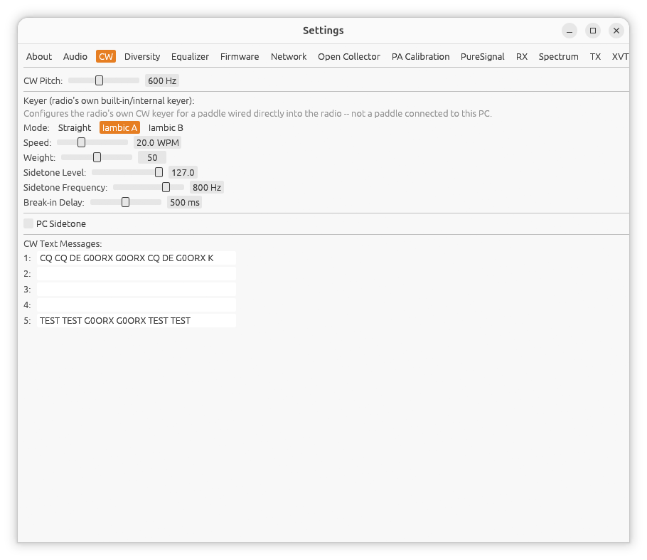

[← Audio](05-settings-audio.md) | [Index](README.md) | [Diversity →](07-diversity.md)

# Settings: CW

Open **Settings...** from the main window, then the **CW** tab.

## CW Pitch

**CW Pitch** (300-1000 Hz, 600 Hz by default) is the audio pitch
**CWL**/**CWU** centers on -- it affects the RX filter, the
[click-to-tune centering](02-main-window.md#cw-decode) on the main
window's spectrum/waterfall, and the TX Tune tone. It's a single setting
shared by the main receiver and every extra receiver window (no
per-receiver override), since it's really "what pitch do you want to
hear/zero-beat CW at" rather than a per-receiver hardware setting.

## Keyer (radio's own built-in/internal keyer)

These controls configure the radio's own CW keyer, for a paddle wired
directly into the radio -- **not** a paddle connected to this PC. hpsdr-rs
sends them to the radio on every packet; the radio's own firmware reads
the physical paddle contacts and handles the iambic/straight-key timing,
sidetone, and TX/RX switching entirely on its own.

- **Mode** -- **Straight**, **Iambic A**, or **Iambic B** (Iambic A by
  default).
- **Speed** -- 1-60 WPM, 16 WPM by default.
- **Weight** -- 0-100, 50 by default. The dot/dash timing ratio: 50 is
  the standard 1:3 ratio; higher lengthens dashes and shortens dots,
  lower does the reverse.
- **Sidetone Level** -- 0-127, 50 by default.
- **Sidetone Frequency** -- 100-1000 Hz, 800 Hz by default. What you
  hear in your own headphones while sending -- independent of **CW
  Pitch** above, which is the RX side.
- **Break-in Delay** -- 0-1000 ms, 500 ms by default. How long the radio
  holds TX after the last paddle element before dropping back to RX.
- **PC Sidetone** -- off by default. Also plays the sidetone through
  this PC's own audio output (using **Sidetone Level**/**Sidetone
  Frequency** above), in addition to whatever the radio's own internal
  keyer does on its own local speaker/headphone output. Useful when the
  radio has no local audio output of its own, or for remote operation.

## CW Text Messages

Up to 5 saved messages, each in its own single-line text field (**1**
through **5**). These are sent as real CW via the **SEND CW**/**STOP**
control on the main window, at the **Speed**/**Weight** set above,
through the radio's own transmitter -- this doesn't use the internal
keyer above, since there's no paddle involved; hpsdr-rs generates the CW
carrier directly. See [Main Window](02-main-window.md#transmit-controls)
for the Send/Stop control itself.

Kenwood CAT's `KY` command and rigctl's `send_morse`/`stop_morse` also
send real CW this way, at the same Speed/Weight configured here, though
neither has any control of its own on this tab.

---

[← Audio](05-settings-audio.md) | [Index](README.md) | [Diversity →](07-diversity.md)
