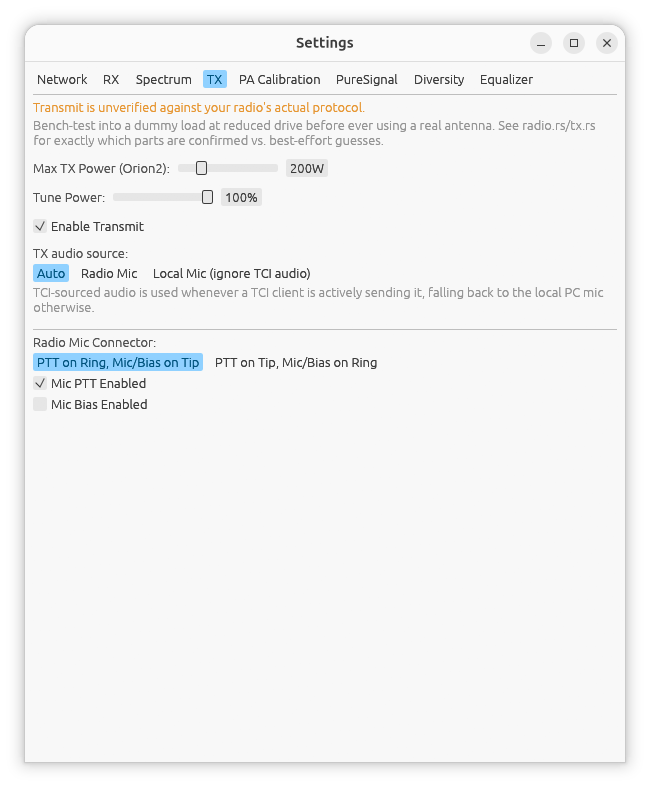

← [Manual index](README.md)

# Settings: TX

Open **Settings...** from the main window, then the **TX** tab.

> **Transmit is unverified against your radio's actual protocol.**
> Bench-test into a dummy load at reduced drive before ever using a real
> antenna -- see the [top-level README](../../README.md) for what's
> confirmed vs. best-effort in the current build.

## Max TX Power

The ceiling for the **TX Power** slider on the main window, in watts
(1-1000W). Set this to your radio's actual maximum output -- the discovery
protocol reports board *type* (e.g. "Orion2"), not the specific model's
real power rating, so a 100W and a 200W radio of the same board family both
need this set correctly by hand. A sensible per-board default is applied
automatically the first time you connect to a given radio.

## Tune Power

The percentage (1-100%) of TX Power actually used while **TUNE** or **TWO
TONE** is engaged from the main window -- keep this low for safe antenna/
amplifier tuning rather than transmitting at full power.

## Enable Transmit

Arms (or disarms) the whole TX signal path -- microphone input, the TX DSP
chain, and the TX-spectrum display. Disarming forces MOX off immediately if
it was active. The PTT row on the main window only appears while this is
enabled.

## TX audio source

Chooses where TX audio comes from:

- **Auto** -- radio mic normally, TCI client audio when one is actively
  streaming.
- **Radio Mic** -- always use the radio's own mic input, ignoring any TCI
  client audio.
- **Local Mic (ignore TCI audio)** -- always use this computer's local
  microphone, ignoring both the radio's mic input and TCI audio. Useful as
  a workaround if a particular TCI client's audio streaming has problems.

## Radio Mic Connector (Angelia/Orion/Orion2 only)

Two settings for boards with a shared PTT/mic/bias connector:

- Connector wiring: **PTT on Ring, Mic/Bias on Tip** or **PTT on Tip, Mic/
  Bias on Ring** -- match this to how your microphone/footswitch is
  actually wired.
- **Mic PTT Enabled** -- whether the radio should accept PTT from that
  connector at all.
- **Mic Bias Enabled** -- whether to supply bias voltage for an electret
  mic element.
