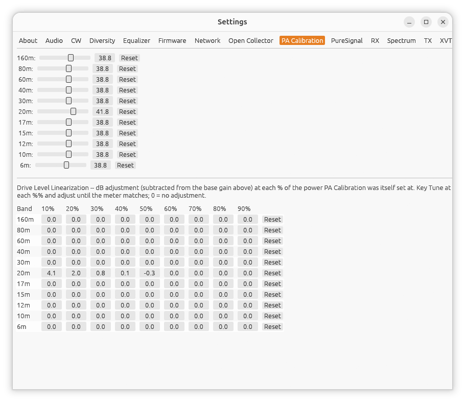

← [Manual index](README.md)

# Settings: PA Calibration

Open **Settings...** from the main window, then the **PA Calibration** tab.

(Screenshot needed: the PA Calibration settings tab)

Every amplifier's actual output power vs. drive-level response varies by
band. This tab lets you dial in a per-band gain correction so the TX Power
slider on the main window tracks real watts-out reasonably accurately
across all bands, rather than just one.

One row per band, each with:

- A gain slider, **20.0-50.0 dB**, in 0.1 dB steps (default 38.8 dB until
  you calibrate a band).
- A **Reset** button that removes that band's calibration entry, reverting
  it to the default gain.

## How to calibrate a band

1. Tune to that band and key up (**TUNE** is a safe, steady signal for
   this) at a known drive level.
2. Compare the power your PA/wattmeter actually reports against what the
   main window's TX Power meter shows.
3. Adjust that band's gain slider up or down until the two agree.
4. Repeat for each band you operate on -- bands you never touch can be
   left at the default.

Settings persist automatically per radio, so this only needs doing once
per band, per radio.
