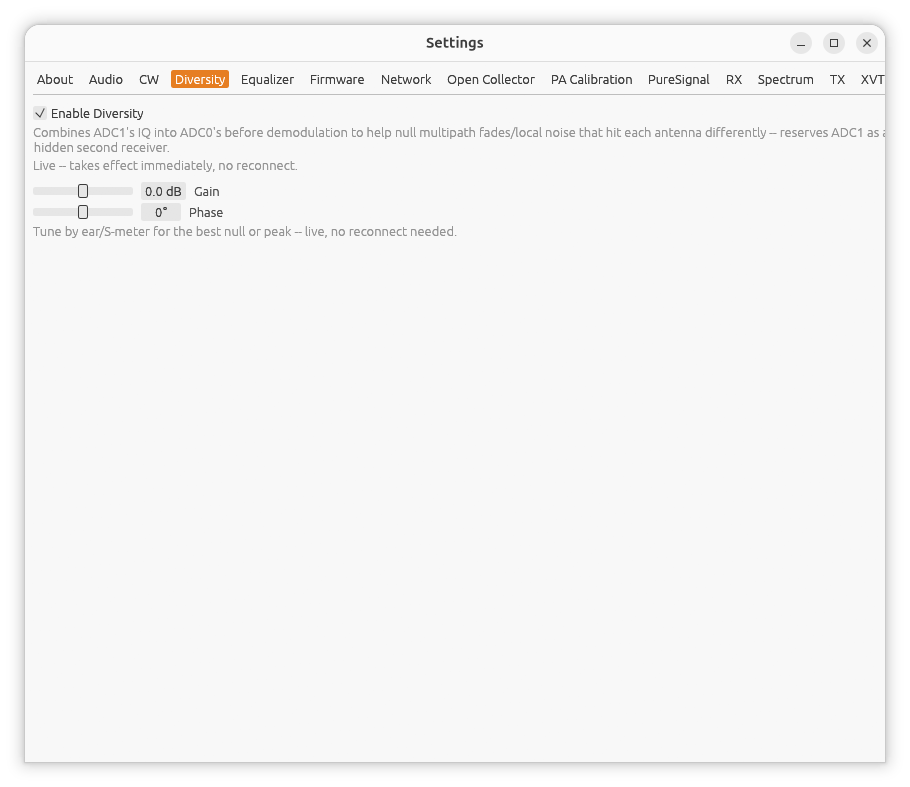

[← PureSignal](08-puresignal.md) | [Index](README.md) | [Equalizer →](10-equalizer.md)

# Settings: Diversity

Open **Settings...** from the main window, then the **Diversity** tab. This
tab only appears on radios with two ADCs. It's mutually exclusive with
[PureSignal](08-puresignal.md).

## What it does

Diversity reception combines the second ADC's received signal into the
main receiver's, after rotating it by an adjustable gain and phase. If your
radio has two antennas (or one antenna split into two inputs) that pick up
a wanted signal similarly but pick up noise or multipath fading
differently, tuning the phase/gain to cancel that difference can
significantly clean up reception. This reserves the second ADC as a hidden
extra receiver behind the scenes.

## Enabling

Check **Enable Diversity**. Unlike PureSignal, this takes effect
immediately -- no reconnect needed, and it can be toggled on/off freely
while listening.

Once enabled, two sliders appear:

- **Gain** -- -27.0 to 27.0 dB.
- **Phase** -- -180° to 180°.

## Tuning it

There's no automatic calibration -- tune Gain and Phase by ear (or
watching the S-meter) for the best null of an interfering signal, or the
best peak of a wanted one. Both sliders take effect live as you move them.

---

[← PureSignal](08-puresignal.md) | [Index](README.md) | [Equalizer →](10-equalizer.md)
