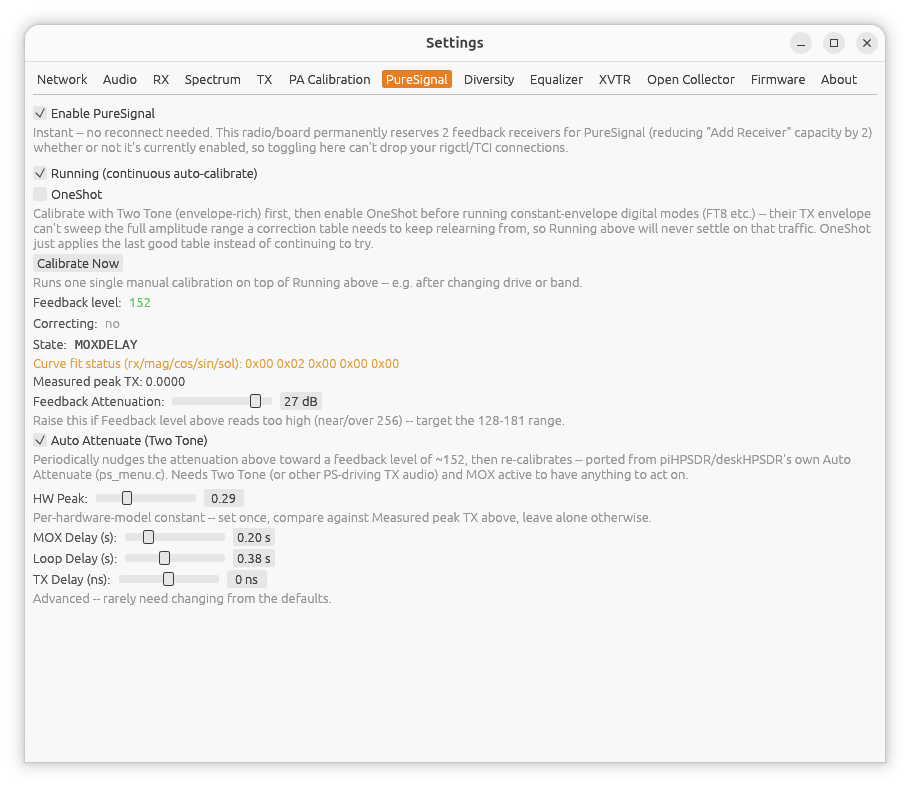

[← PA Calibration](08-pa-calibration.md) | [Index](README.md) | [Diversity →](10-diversity.md)

# Settings: PureSignal

Open **Settings...** from the main window, then the **PureSignal** tab.
PureSignal predistorts your TX signal to linearize your amplifier, reducing
splatter/IMD. It's mutually exclusive with [Diversity](10-diversity.md) --
both reserve extra receiver resources on the radio in incompatible ways, so
only one can be enabled at a time.

## Enabling

Check **Enable PureSignal**. This takes effect immediately -- no
reconnect needed, and it can be toggled on/off freely. Note that on a
PureSignal-capable radio, the two feedback receivers PureSignal needs are
reserved for the whole session as soon as you connect, whether or not
PureSignal is actually enabled -- so [Extra Receivers](12-extra-receivers.md)'
maximum count is 2 lower than the radio's full capacity on any such radio.

Once enabled (and TX armed), the rest of this tab's controls appear:

- **Running (continuous auto-calibrate)** checkbox.
- **Calibrate Now** -- runs one manual calibration pass immediately.
- **Feedback level** -- a colored readout of the feedback receiver's signal
  strength: red below 90 (too weak), yellow 90-127, green 128-181 (ideal),
  blue 182-256, red above 256 (too strong). Despite the "ideal" range, this
  is a rough guide, not a hard requirement -- calibration has been
  confirmed working well outside it, as long as HW Peak (below) is right.
- **Correcting** -- yes/no, turns green once PureSignal is actively
  applying correction.
- **Measured peak TX** -- the actual envelope peak PureSignal is currently
  measuring.
- **Feedback Attenuation** (non-HermesLite boards) -- 0-31 dB, adjust to
  keep Feedback Level in the ideal range. Same underlying value as
  [Settings: TX](07-settings-tx.md)'s **TX ADC0 Attenuation** -- it isn't
  PureSignal-specific, it protects ADC0 from this radio's own TX leakage
  generally, PureSignal or not.
- **HW Peak** -- 0.0-1.0. See below; this is the setting that actually
  matters most.
- **MOX Delay**, **Loop Delay**, **TX Delay**, **Ptol** -- advanced timing/
  tolerance parameters, rarely need changing from their defaults.

The correction table auto-saves the first time calibration succeeds each
session, and auto-restores from disk the next time you enable PureSignal on
the same radio -- there's no manual save/restore step.

## Calibration procedure

**HW Peak** is the one setting that actually matters, and the first thing
to change if calibration won't complete or **Correcting** never turns on.
It has to track the *real* envelope peak your radio produces at whatever
drive level you're actually calibrating at -- it is **not** a fixed
per-board constant to leave alone.

1. Set **Tune Power %** (Settings → TX) low -- start around 10-15%.
   PureSignal calibration works best at a low real TX drive level, not a
   normal operating power.
2. Press **TWO TONE** on the main window (not **TUNE** -- a steady tone's
   constant envelope can never fill PureSignal's calibration buckets) and
   watch **Measured peak TX** in this tab for a few seconds.
3. Set **HW Peak** to just above whatever Measured peak TX settled at.
4. Re-engage **TWO TONE**. **Correcting** should turn on within a few
   seconds. If it doesn't:
   - Stuck with Feedback Level at 0 and no progress: HW Peak is likely
     still too far from the true peak -- recheck Measured peak TX and
     adjust again.
   - **Correcting** flickers on/off or never turns on despite Feedback
     Level being nonzero: try nudging Tune Power % up or down a little and
     repeat from step 2 -- the exact drive level a clean calibration
     converges at is somewhat radio-dependent.

---

[← PA Calibration](08-pa-calibration.md) | [Index](README.md) | [Diversity →](10-diversity.md)
