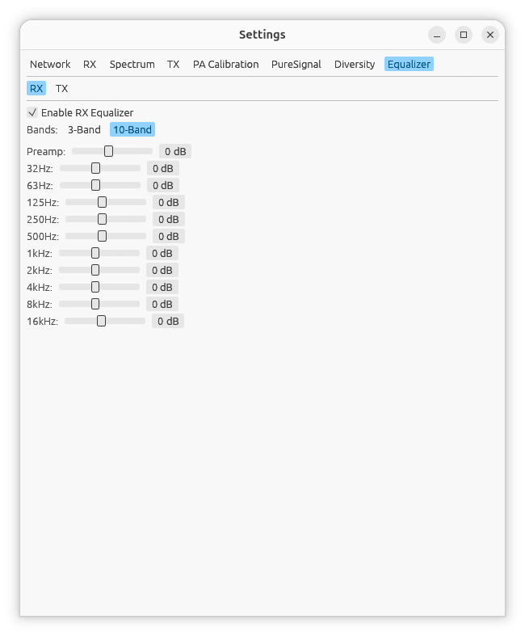

← [Manual index](README.md)

# Settings: Equalizer

Open **Settings...** from the main window, then the **Equalizer** tab.

hpsdr-rs offers a graphic equalizer for both received audio and (if TX is
armed) transmitted audio.

## RX vs. TX

If TX is armed, an **RX** / **TX** selector at the top of the tab chooses
which one the rest of the panel edits -- they have entirely independent
settings. If TX isn't armed, only the RX equalizer is shown.

Each independently-added [extra receiver window](11-extra-receivers.md)
has its own equalizer too, in its own Settings window's **EQ** tab (RX
only -- extra receivers never transmit) -- adjusting the main receiver's EQ
doesn't affect them, or each other.

## Controls

- **Enable RX/TX Equalizer** -- turns that side's EQ on or off. Off by
  default (flat response).
- **Bands** -- **3-Band** or **10-Band**:
  - 3-Band: **Low**, **Mid**, **High**.
  - 10-Band: **32Hz, 63Hz, 125Hz, 250Hz, 500Hz, 1kHz, 2kHz, 4kHz, 8kHz,
    16kHz**.
- **Preamp** -- an overall gain applied on top of the individual bands.
- Each band slider: **-12 to 15 dB**.

Switching between 3-Band and 10-Band keeps each mode's own dialed-in gains
independently -- flipping back and forth doesn't lose either set.
