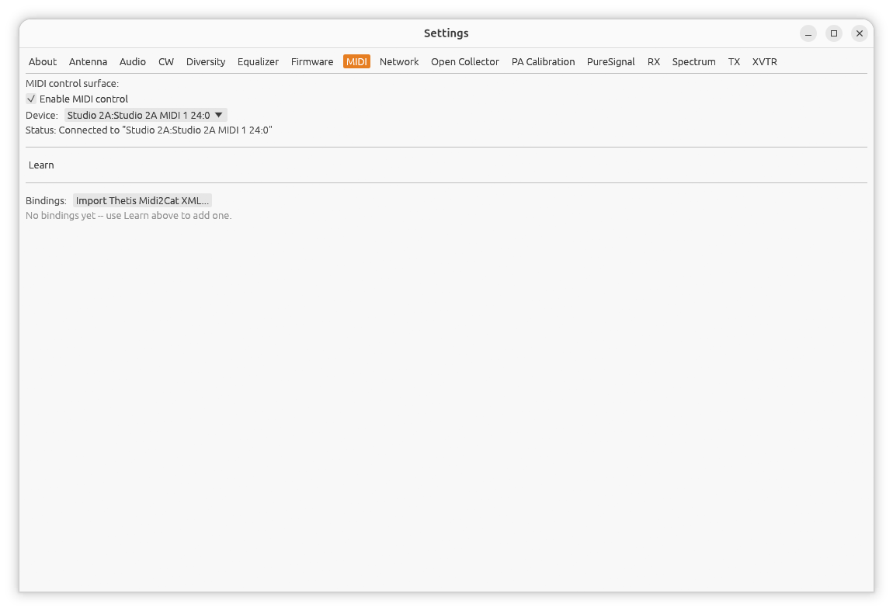
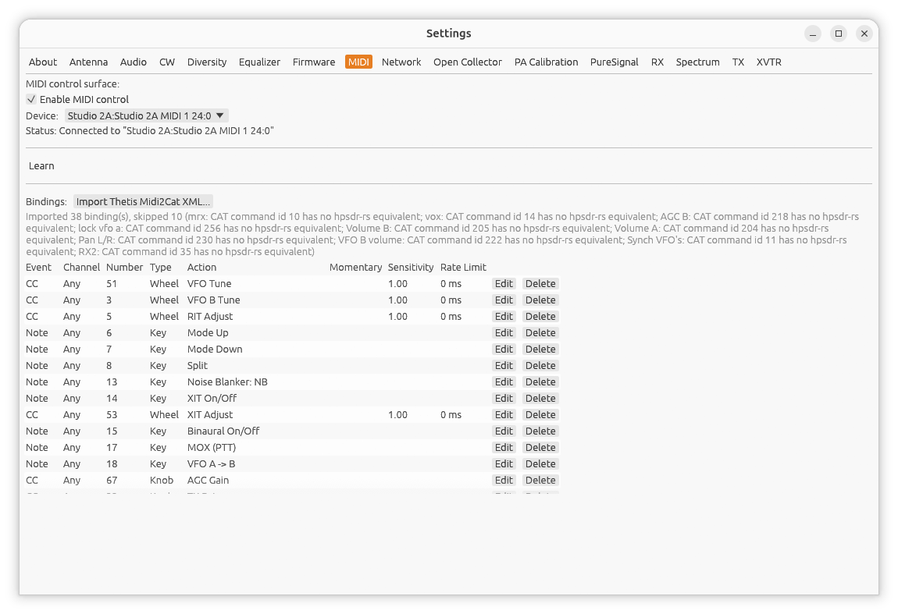

[← Firmware Update](09-firmware-update.md) | [Index](README.md) | [Network →](11-settings-network.md)

# Settings: MIDI

Open **Settings...** from the main window, then the **MIDI** tab.



hpsdr-rs can be controlled from any class-compliant USB or DIN MIDI
controller -- a control-surface box, DJ mixer, or anything else that
speaks standard MIDI notes/CCs/pitch-bend. There's no list of supported
devices: you connect whatever you have, then teach the app what each of
its knobs, sliders, and buttons should do using **Learn** mode below.
Nothing is pre-mapped.

## Enable / Device

- **Enable MIDI control** -- off by default. Turning this on starts
  looking for the selected device; turning it off disconnects
  immediately.
- **Device** -- a dropdown of MIDI input ports currently visible to the
  operating system. Pick your controller here (plug it in first if it
  isn't listed yet -- the list only refreshes while this tab is open).
- **Status** -- shows **Disabled**, **Searching for "..."**, **Connected
  to "..."**, or an error message. If your controller is unplugged and
  replugged while connected, hpsdr-rs reconnects automatically within a
  second or two -- no need to re-enable anything.

## Learn mode

This is how you map a physical control to a radio action:

1. Click **Learn**. The button highlights and a "Move a control on your
   MIDI device..." prompt appears.
2. Move the knob, slider, or press the button you want to map. hpsdr-rs
   captures it and shows what it saw -- e.g. "Captured: CC 20 on Channel
   1" or "Captured: Note 60 on Channel 1".
3. If you moved a knob/slider (a Control Change or Pitch Bend message,
   which is ambiguous on the wire), choose whether it's a **Knob
   (absolute)** or **Wheel (relative)** control -- see
   [Knob vs. Wheel controls](#knob-vs-wheel-controls) below if you're
   not sure which your hardware sends.
4. Tick **Any channel** if you want this binding to respond on every
   MIDI channel, not just the one it was captured on.
5. Choose an **Action** from the dropdown -- the list is filtered to
   whatever makes sense for the kind of control you captured (see
   [Actions](#actions) below).
6. For a button bound to **MOX (PTT)** or **Tune**, an extra
   **Momentary** checkbox appears -- tick it for press-to-transmit/
   release-to-receive behavior instead of toggling on every press.
7. For a Wheel binding, **Sensitivity** and **Rate limit (ms)** controls
   appear -- see [Wheel sensitivity and rate limiting](#wheel-sensitivity-and-rate-limiting)
   below.
8. Click **Add**.

The new binding appears in the table below and takes effect immediately.
To change an existing binding, click **Edit** on its row (this re-opens
the same form, with an **Update** button in place of **Add**); click
**Delete** to remove it. Bindings are saved automatically along with
every other radio setting -- no separate save step. The table scrolls
once it grows past a few rows, so a controller with many mapped
controls -- or a full import, see below -- stays reachable.

## Importing from Thetis (Midi2Cat XML)



If you already have a MIDI controller mapped in
[Thetis](https://github.com/ramdor/Thetis)'s **Midi2Cat** feature, you
can import that mapping instead of re-learning every control by hand:

1. In Thetis, open **Setup -> MIDI -> Configure MIDI**, then use **Save
   Mapping As** (in the window that opens, or a device-setup sub-window
   reached from it) to export your mapping to an XML file.
2. In hpsdr-rs, click **Import Thetis Midi2Cat XML...** (next to
   **Bindings:**) and pick that file.
3. A summary appears underneath the button: how many controls imported,
   and how many were skipped (with a reason for each).

Not every Thetis command has an hpsdr-rs equivalent, so some controls
are always expected to be skipped -- e.g. Thetis's absolute-knob RIT
control has no match here (hpsdr-rs's RIT is wheel/relative-adjust
only), and anything tied to a Thetis feature hpsdr-rs doesn't have
(VOX, VFO Lock, a second independent receiver's own AGC/volume) can't
be imported at all. The skip reason names the specific Thetis command
so you can tell at a glance whether it's worth re-learning that control
by hand instead.

Importing a control that's already bound (to the exact same MIDI
event/channel/number) replaces the existing binding rather than adding
a duplicate -- safe to re-import the same file, or import a second
controller's file on top, without cleaning up first.

## Troubleshooting: seeing what a control sends

If a control doesn't do what you expect -- or you're not sure what a
freshly-imported binding actually maps to on your hardware -- run
hpsdr-rs from a terminal and watch its output while you move the
control. Any MIDI message that doesn't match a configured binding
prints a line like:

```
midi: unmatched ControlChange channel=0 number=45 value=90
```

showing exactly what the control sent (event type, channel, CC/note
number, value), which is often faster than opening **Learn** mode just
to check.

## Actions

**Key** (button/press) actions:

| Action | Effect |
|---|---|
| MOX (PTT) | Toggle transmit on/off (or momentary, see above) |
| Tune | Toggle the Tune tone on/off |
| Split | Toggle Split on/off |
| RIT On/Off, RIT Clear | Toggle RIT, or zero its offset |
| XIT On/Off, XIT Clear | Toggle XIT, or zero its offset |
| VFO A -> B, VFO B -> A, VFO A/B Swap | Copy or swap VFO frequencies |
| Mode Up, Mode Down | Cycle through modes |
| Band Up, Band Down | Cycle through bands |
| Band 160m ... Band 6m | Jump directly to that band (ten separate actions, one per band from 160m to 6m; there's no direct action for 60m -- use Band Up/Down to reach it). Ignored if the connected radio can't tune that band (e.g. 6m on a HermesLite/HermesLite2) |
| Filter Width Up, Filter Width Down | Step the filter width |
| VFO Step Up, VFO Step Down | Nudge the VFO by one tuning step |
| CTUN On/Off | Toggle Click-to-Tune |
| RX Equalizer On/Off | Toggle the RX [graphic equalizer](08-equalizer.md) |
| Diversity On/Off | Toggle [Diversity](07-diversity.md) reception (ignored while PureSignal is enabled -- the two are mutually exclusive) |
| Binaural On/Off | Toggle binaural (phasing) RX audio |
| Spectral Noise Blanker On/Off | Toggle the spectral noise blanker |
| Noise Blanker Cycle, Noise Reduction Cycle | Step through NB/NR states in order (Off -> NB -> NB2 -> Off, and Off -> NR -> NR2 -> NNR -> Off) -- handy for a single button |
| Noise Blanker: Off, Noise Blanker: NB, Noise Blanker: NB2 | Jump directly to that NB state -- handy for one button per state instead of cycling. These only ever turn a state *on*; pressing the same button again does nothing (it's already there) -- bind "Noise Blanker: Off" to a separate control to turn it back off |
| Noise Reduction: Off, Noise Reduction: NR, Noise Reduction: NR2, Noise Reduction: NNR | Same idea as the Noise Blanker direct-select actions above, one per NR state |

**Knob** (absolute 0-127 value) actions:

| Action | Effect |
|---|---|
| AF Gain | Local speaker/headphone volume |
| AGC Gain | AGC gain -- the same control as the main window's **AGC Gain** slider (called **Top** in [Settings: RX](15-settings-rx.md#agc-tuning)) |
| Mic Gain | Microphone input level |
| RF Attenuation | RX step attenuator (0-31 dB) -- shown as **RF Gain** (-12 to +48 dB) instead when bound while connected to a HermesLite/HermesLite2 over Protocol 1, which has no step attenuator; see [Settings: RX](15-settings-rx.md#rx-attenuation--rx-gain) |
| TX Drive | Transmit power |
| CW Speed | The radio's internal keyer speed (WPM) |
| Filter Width | Set the filter width directly |

**Wheel** (relative encoder) actions:

| Action | Effect |
|---|---|
| VFO Tune | Tune the VFO (VFO A, or whichever is active) |
| VFO B Tune | Tune VFO B directly, without switching to it -- useful for Split operation |
| RIT Adjust | Nudge the RIT offset |
| XIT Adjust | Nudge the XIT offset |

## Knob vs. Wheel controls

MIDI Control Change and Pitch Bend messages look the same on the wire
whether they came from an absolute slider (always reports its physical
position, 0-127) or a relative/endless encoder (reports a direction and
speed centered around 64, with no fixed position of its own). hpsdr-rs
can't tell these apart automatically, so Learn mode asks:

- **Knob (absolute)** -- for a fader, slider, or a knob with a fixed
  end-to-end travel. Use this for AF Gain, AGC Gain, Mic Gain, RF
  Attenuation/RF Gain, TX Drive, CW Speed, and Filter Width.
- **Wheel (relative)** -- for an endless rotary encoder (no mechanical
  stops) commonly used for jog wheels/VFO knobs. Use this for VFO Tune,
  VFO B Tune, RIT Adjust, and XIT Adjust.

A Note On/Off message (a button) is never ambiguous -- it's always a
**Key**.

## Wheel sensitivity and rate limiting

Wheel bindings have two extra controls, because MIDI encoders vary
enormously in how "chatty" and fine-grained they are:

- **Sensitivity** (default 1.0) -- scales how far each message moves
  the value. Lower it if a light touch moves too far; raise it if
  turning the control feels sluggish.
- **Rate limit** (default 25ms for a new binding, in milliseconds) --
  the minimum time between two applied steps from that control. Some
  encoders (especially continuous, no-detent jog wheels) send far more
  messages for a single touch than any per-message step size alone can
  stay controllable against -- raising this bounds how many steps per
  second can get through, independent of Sensitivity. If a control still
  feels too touchy after lowering Sensitivity, raise this instead.

Both are editable later from the bindings table (click **Edit**) without
needing to re-learn the control.

---

[← Firmware Update](09-firmware-update.md) | [Index](README.md) | [Network →](11-settings-network.md)
