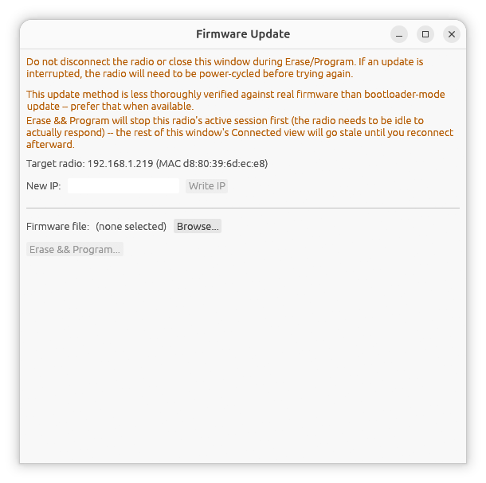
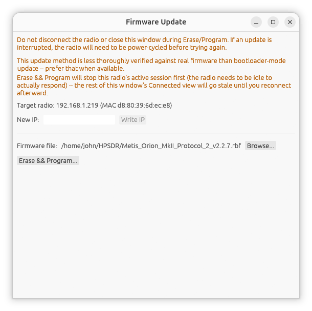

[← Extra Receivers](11-extra-receivers.md) | [Index](README.md)

# Firmware Update

hpsdr-rs can update a radio's FPGA firmware (a `.rbf` file) and change its
static IP address, two entirely separate, unrelated ways depending on
whether the radio is in **bootloader mode** or **normally running**:

| | Bootloader mode | In-application |
|---|---|---|
| Works with | Metis, Hermes, Hermes2, Angelia, Orion, Orion2 | A radio you're already connected to (Protocol 2) |
| Radio state required | Physically switched into bootloader mode, power-cycled | Normally running (hpsdr-rs stops its own session first, automatically) |
| Reached from | Discovery screen → **Firmware Update...** | Settings → Network → **Firmware Update...** |
| Confidence | Well-documented, hardware-confirmed | Less thoroughly verified -- prefer bootloader mode when available |

**Read this whole page before starting an update**, especially the warnings
below -- reflashing firmware is not something to improvise partway through.

## Bootloader mode (recommended)

This is the same mechanism Apache Labs' `HPSDRBootloader` tool uses: raw
Ethernet frames to a fixed address the radio's bootloader firmware answers
to, **not** a normal IP/UDP connection. That has real consequences:

- It only works over a **direct cable or a plain unmanaged switch** -- it
  will not cross a router, VPN, or most managed switches.
- It needs **elevated privileges**, since sending raw Ethernet frames isn't
  something an ordinary user-level program can normally do:
  - **Linux**: run hpsdr-rs as root, or grant the built binary the
    capability once: `sudo setcap cap_net_raw+ep target/release/hpsdr-rs`
  - **Windows**: install [Npcap](https://npcap.com/) (in "WinPcap
    API-compatible mode") and run hpsdr-rs as Administrator
  - **macOS**: run as root, or grant access to `/dev/bpf*`

  If you see a permission error opening the network interface, this is why.

### Before you begin

**Switch the radio into bootloader mode and power-cycle it** -- a jumper or
slide switch, board-dependent; see your radio's own documentation for
exactly where. It won't respond to anything below until you do this. A
radio in bootloader mode also won't appear in the normal Discovery list --
that's expected, it isn't running the firmware that answers normal
discovery broadcasts.

### Procedure

1. From the Discovery screen, click **Firmware Update...**.
2. Choose the **network interface** connected to the radio (direct cable or
   plain switch).
3. Click **Test for Bootloader** -- confirms a radio is actually present
   and answering, and shows its MAC address. This is read-only and safe;
   always do this first.
4. *(Optional)* Click **Read Current IP** to see the radio's current
   address, or enter a new one and click **Write IP** to change it (no
   confirmation reply is expected -- read it back afterward to confirm).
   `0.0.0.0` reverts the radio to DHCP/APIPA.
5. Click **Browse...** and select the `.rbf` firmware file.
6. Click **Erase && Program...**, then confirm. Progress is shown for
   Erasing (can take up to a few minutes) and then Programming
   (block-by-block).
7. When it completes, **switch the radio back out of bootloader mode and
   power-cycle it** before normal use -- the app reminds you of this on
   screen.

(Screenshot needed: the Firmware Update window, bootloader mode, mid-Program)

### If something goes wrong

If Erase or Program is interrupted (dropped packet, timeout, or you click
**Cancel**), the radio's bootloader firmware has no way to recover on its
own -- **power-cycle the radio before trying again**. This can't brick the
radio permanently: Erase/Program can only reach the separate "Application"
flash region, never the bootloader/recovery image itself, so re-entering
bootloader mode and trying again is always possible.

## In-application update

Reached from **Settings → Network → Firmware Update...** while connected to
a Protocol 2 radio. No physical mode switch needed -- but this path is
**less thoroughly verified** against real firmware than bootloader mode, so
prefer that when your radio supports it (i.e. whenever you can get a direct
cable/switch connection to it).

Clicking **Erase && Program** here first **stops this radio's active
session** automatically (the radio needs to be genuinely idle to respond --
it was found to just echo a generic status reply otherwise) -- the main
window's display will go stale/frozen for the rest of the update. Once the
update completes, hpsdr-rs **reconnects automatically** using this radio's
saved settings, the same as a manual Stop → rediscover → Start, so you
don't need to do anything further. The window title bar's firmware version
(shown next to **P1**/**P2**) updates to reflect the new firmware once
reconnected.

A failed in-application update does **not** reconnect automatically --
check the error shown before trying again.

(Screenshot needed: the Firmware Update section under Settings -> Network)

## Both paths

- A firmware file must be selected via **Browse...** (a native file picker)
  -- a warning appears if the chosen file doesn't have a `.rbf` extension,
  though it isn't blocked.
- Neither path will retry a dropped page mid-upload -- the firmware itself
  can't resume a desynced transfer, so any anomaly aborts the whole upload
  rather than guessing at a partial recovery.
- **Do not disconnect the radio or close the Firmware Update window while
  Erase or Program is running.**

---

[← Extra Receivers](11-extra-receivers.md) | [Index](README.md)
