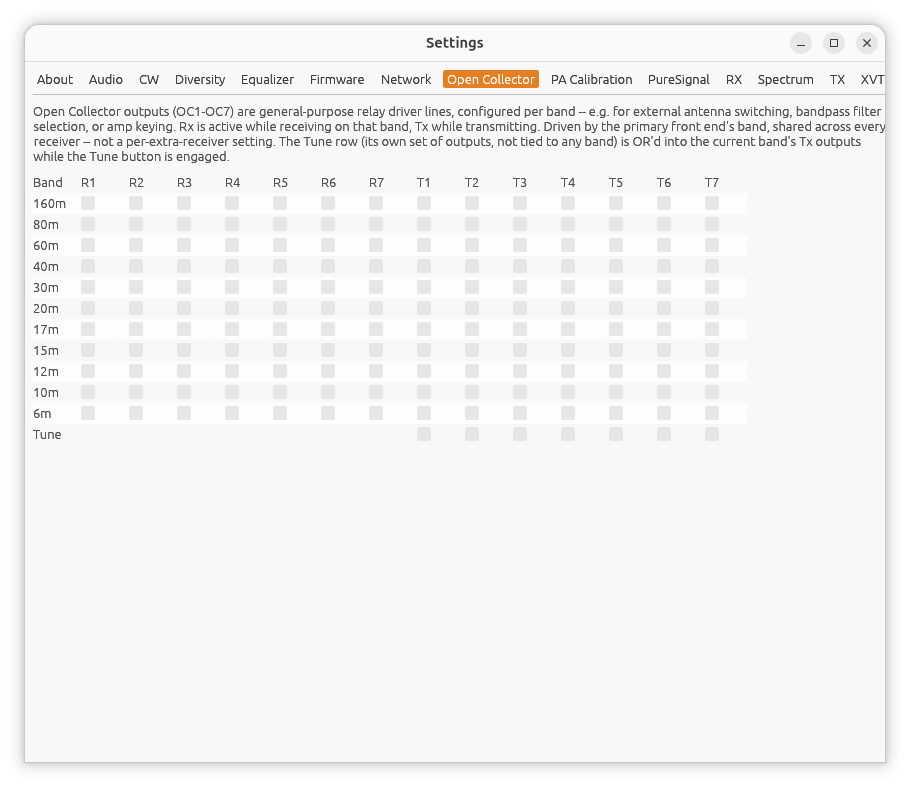

[← Network](11-settings-network.md) | [Index](README.md) | [PA Calibration →](13-pa-calibration.md)

# Settings: Open Collector

Open **Settings...** from the main window, then the **Open Collector** tab.

Open Collector outputs (**OC1**-**OC7**) are general-purpose relay-driver
lines present on most HPSDR boards -- used for things like external antenna
switching, bandpass filter selection, or amplifier keying. This tab lets you
configure which outputs are active on each band, separately for receive and
transmit.

One row per band, plus a **Gen** row (general coverage -- see [Main
Window](02-main-window.md#bands-and-modes)) and a row per configured
[XVTR](18-xvtr.md) slot with a non-empty name:

- **Rx** -- which of OC1-OC7 are active while receiving on that band.
- **Tx** -- which are active while transmitting on that band.
- **Tune** (its own row at the bottom) -- a single set of outputs, not tied
  to any one band, that get OR'd into the current band's **Tx** outputs
  whenever the Tune button is engaged.

Unchecked means that output is off. There's no "leave alone" state -- every
packet sent to the radio declares the full set of outputs that should be
active right now.

## Filter Board

Above the OC table, on every board except HermesLite/HermesLite2 (which
have their own separate "HL2+ Audio Codec" addon concept instead -- see
Settings: Audio), a **Filter Board** selector declares which analog
front-end/filter addon board is physically fitted: **None**, **Alex**,
**Apollo**, **Charly25**, or **N2ADR** -- matching piHPSDR's own
`filter_board` setting.

- **Alex** (the default, matching this app's behavior before this selector
  existed) -- the standard Hermes/Angelia/Orion/Orion2 front end. Enables
  Alex's antenna/attenuation/bandpass register.
- **Apollo** -- the Apollo PA/ATU combo. Enables its tuner-control bits.
  Matching piHPSDR exactly, this does *not* also enable Alex's own
  register -- select Alex instead if you don't have an Apollo fitted.
- **Charly25** -- a RedPitaya-based front end (P1 only). Selecting it
  reveals two extra checkboxes:
  - **Preamp Stage 1 (+18dB)** and **Preamp Stage 2 (+18dB)** -- Charly25
    repurposes two normally-unused ADC control bits as a pair of +18dB
    gain stages. The S-meter, spectrum, and waterfall are automatically
    compensated by -18dB per active stage, so displayed levels stay
    antenna-referenced regardless of which stages are switched in.
- **N2ADR** -- see below.
- **None** -- no addon board at all. Alex's own register is not sent, for
  a plain Hermes/Metis board with nothing fitted.

Changing this takes effect live, no reconnect needed.

### N2ADR filter board preset

Selecting **N2ADR** immediately fills in the 10 ham-band rows below with
the N2ADR LPF board's own OC1-OC7 relay values -- a common Hermes-Lite 2
add-on, matching piHPSDR's own N2ADR filter-board preset exactly (including
applying it the moment you select it, not as a separate step). A
**Re-apply N2ADR Filter Board preset** button appears while N2ADR is
selected, in case you've since changed one of those rows by hand and want
to restore the defaults. Either way, this overwrites those 10 rows only --
Gen, any XVTRs, and Tune are left untouched, and you can still adjust
individual checkboxes afterward if your wiring differs.

## Which band applies

Whichever band the primary receiver's real hardware frequency (or, if a
transverter is active, its configured RF range) currently falls in --
shared across every receiver, the same way antenna and PA gain selection
already are, since there's only one physical front end. Extra receiver
windows don't have their own Open Collector settings.

## Limitations

- **N2ADR confirmed working** on a real Hermes-Lite 2 with an N2ADR filter
  board fitted. **Alex confirmed working** on a real plain Alex-equipped
  board too.
- The rest of this feature has not been verified against real Open-
  Collector-driven relays/filters generally -- check with a meter or by ear
  (relay click) before relying on it for anything that could be damaged by
  the wrong filter path being selected.
- The Filter Board selector's Apollo and Charly25 handling is ported
  directly from piHPSDR's source (exact protocol bytes/bits), but not yet
  confirmed against real Apollo or Charly25 hardware -- if you have either,
  a real-world report (does the PA/tuner actually respond, do the preamp
  stages and their S-meter compensation look right) would help confirm it.

## Settings: Antenna

The **Antenna** tab, next to Open Collector, works the same way for RF
antenna port selection -- one row per band (plus **Gen** and any
configured XVTR), an **RX** column (**ANT1**/**ANT2**/**ANT3**, plus
**EXT1**/**EXT2**/**XVTR** where applicable) and a **TX** column
(**ANT1**-**ANT3** only). Same "which band applies" rule as Open
Collector above.

---

[← Network](11-settings-network.md) | [Index](README.md) | [PA Calibration →](13-pa-calibration.md)
