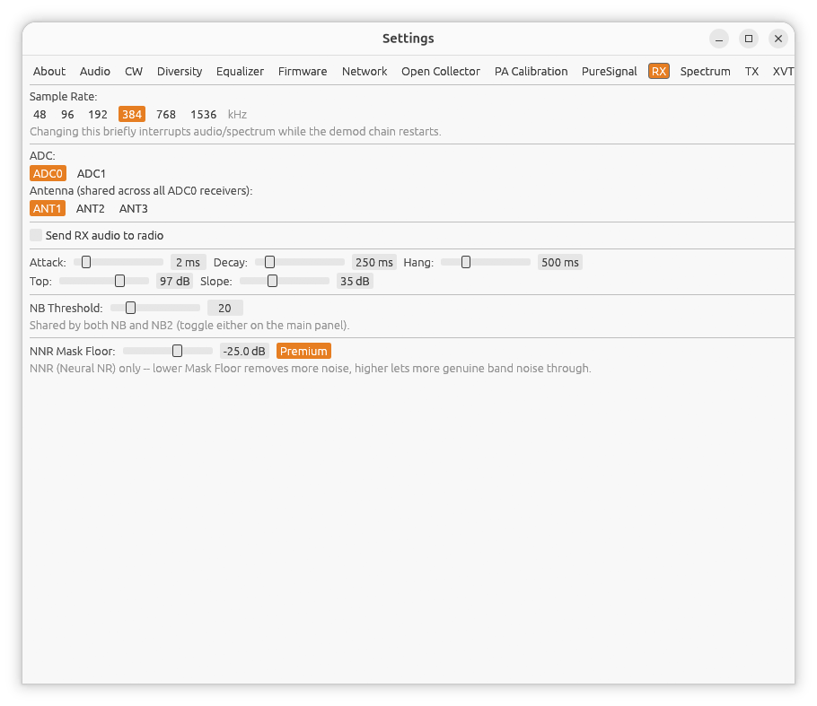

[← PureSignal](13-puresignal.md) | [Index](README.md) | [Spectrum →](15-settings-spectrum.md)

# Settings: RX

Open **Settings...** from the main window, then the **RX** tab.

## Sample rate

Selectable buttons for the receiver's sample rate. Protocol 2 radios offer
**48, 96, 192, 384, 768, 1536** kHz; Protocol 1 radios offer **48, 96, 192,
384** kHz. Changing this briefly interrupts audio/spectrum while the demod
chain restarts.

## ADC and antenna (Protocol 2 only)

On boards with more than one ADC, **ADC** buttons choose which one the
main receiver listens to. If **ADC0** is selected, an **Antenna** row
appears -- **ANT1, ANT2, ANT3** -- since ADC0's antenna selection is shared
across every receiver using it.

## RX attenuation (Protocol 1 only)

On Protocol 1 boards other than HermesLite/HermesLite2, an **RX
Attenuation** slider (0-31 dB) reduces the receiver's input level -- turn
this up if you're overloading the front end on a strong signal, and back
down if signals seem unusually weak.

## Send RX audio to radio

A checkbox that routes the demodulated audio back out through the radio's
own local audio jack, in addition to your computer's speakers. On a
HermesLite2, this is how you'd feed the PHONES jack on an add-on board
(e.g. one built around an AK4951 codec) that adds PHONES, MIC, and KEY
jacks to emulate a standard HPSDR radio's audio I/O -- that board uses
its own dedicated firmware build. On a stock HermesLite/HermesLite2 with
no such add-on, enabling this is harmless (the firmware simply has
nothing to do with the audio) but obviously won't produce any audible
output, since there's no local audio hardware to play it through.

## AGC tuning

Six sliders fine-tune the AGC curve (the AGC mode itself -- Off/Long/Slow/
Medium/Fast -- is toggled from the main window, not here):

| Slider | Range | Step |
|---|---|---|
| Attack | 0-20 ms | 1 |
| Decay | 0-2000 ms | 25 |
| Hang | 0-2000 ms | 25 |
| Top | 0.0-140.0 dB | 2.0 |
| Slope | 0-100 dB | 2 |
| Thresh | -140.0-0.0 dB | 2.0 |

**Top** is also available directly on the main window as **AGC Gain**
(piHPSDR's name for the same value) -- both control the identical setting.

## Noise blanker threshold

**NB Threshold** (0-100) is shared by both blanker stages (NB and NB2,
toggled from the main window) -- there's only one threshold, whichever
stage is active uses it.

---

[← PureSignal](13-puresignal.md) | [Index](README.md) | [Spectrum →](15-settings-spectrum.md)
